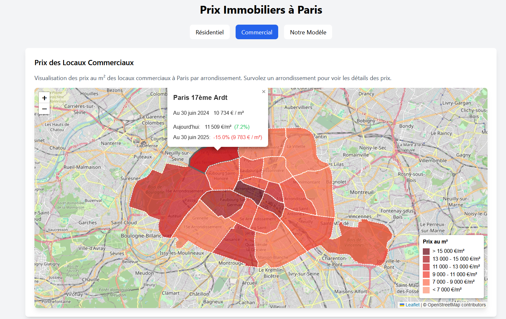

# Real-Estate-predictions
Machine Learning project for M2 actuarial ISUP
--- 
- [Real-Estate-predictions](#real-estate-predictions)
  - [Machine Learning project for M2 actuarial ISUP](#machine-learning-project-for-m2-actuarial-isup)
- [Machine Learning](#machine-learning)
  - [Données](#données)
    - [Transactions immobilières](#transactions-immobilières)
    - [Autres données](#autres-données)
  - [Rapport](#rapport)
    - [Présentation](#présentation)
    - [Conclusion](#conclusion)
  - [Code](#code)
- [Data Visualisation](#data-visualisation)
  - [Lancer le site en local](#lancer-le-site-en-local)
  - [Architecture](#architecture)
    - [Onglet de prédiction des biens résidentiels](#onglet-de-prédiction-des-biens-résidentiels)
    - [Onglet de prédiction des biens commerciaux](#onglet-de-prédiction-des-biens-commerciaux)
    - [Onglet d'explication de notre modèle](#onglet-dexplication-de-notre-modèle)


---

# Machine Learning

## Données 

### Transactions immobilières

Voici ce que l'on peut lire au sujet de l'aggregation des données fourni par **CEREMA** : 

```
Depuis mai 2019, les données "Demande de Valeurs Foncières" (DVF) sont disponibles en open-data sur le site data.gouv.fr.

La DGALN et le Cerema propose "DVF+ open-data", qui permet d'accéder librement à cette même donnée sous la forme d'une base de données géolocalisée aisément exploitable pour l'observation des marchés fonciers et immobiliers.

La structuration de la donnée DVF proposée s'appuie sur le modèle de données partagé dit "DVF+", issu des travaux menés à l'initiative du groupe national DVF et qui existe depuis 2013. Ce modèle, développé pour faciliter les analyses, fournit notamment une table des mutations dans laquelle chaque ligne correspond aux informations et à la localisation d'une transaction. 

La géolocalisation s'appuie sur les différents millésimes du Plan cadastral informatisé également disponibles en open-data sur data.gouv.fr.

Chacune des variables du modèle DVF+ est calculée uniquement à partir des données brutes de DVF. Les variables calculées s’appliquent sur l’ensemble du territoire et relèvent d’une méthodologie partagée. Il n’y a pas de données exogènes à ce stade hormis les données de géolocalisation issue du PCI Vecteur.

A noter que le modèle DVF+ constitue également le socle pour la constitution de la base de données DV3F.
```

Voici le [lien](https://datafoncier.cerema.fr/donnees/autres-donnees-foncieres/dvfplus-open-data) pour pouvoir accéder aux données.


Les données se trouvent dans data. Pour les fichiers de transactions sont de la forme mutations_d{departement}.csv et sont **à jour jusqu'à octobre 2024**.


### Autres données

Pour tenter de prédire les prix futurs, nous allons utiliser les données explicatives suivantes (les liens de téléchargements sont disponibles en cliquant sur le nom):

- [**Les taux en vigueur**](https://webstat.banque-france.fr/fr/catalogue/estr/ESTR.B.EU000A2X2A25.WT)
- [**Le cours du pétrol**](https://www.eia.gov/dnav/pet/hist/LeafHandler.ashx?n=PET&s=RBRTE&f=A)
- [**La confiance des ménages**](https://www.insee.fr/fr/statistiques/7758403)

## Rapport

Le rapport est disponible sous format [pdf](ML_Real_Estate_Forecasting.pdf) ou [ipynb](ML_Predictions_Notebook.ipynb) selon les préférences et concerne les données de l'île-de-France. (75, 77, 78, 91, 92, 93, 94, 95)

### Présentation

Notre jeu de données combine plusieurs sources :

1. Données immobilières (mutations_d75.csv) :
   - Transactions immobilières sur Paris et l'île de France
   - Variables principales : date_mutation, type_bien, surface, prix, code_insee
   
2. Données macroéconomiques :
   - Indice de confiance des ménages (confiance_menage.csv)
   - Taux directeur de la BCE (taux.csv)
   - Cours du pétrole Brent (petrole.csv)

Cette combinaison nous permet d'analyser l'impact des facteurs économiques sur les prix immobiliers.

Notre objectif est d'essayer de prédire au mieux le prix d'un appartement selon le contexte économique et les caractéristiques de l'appartement.

### Conclusion

L'analyse du marché immobilier francilien révèle une dynamique où la géographie prime sur l'économie. Notre modélisation XGBoost, avec un R² de 0.74, démontre que le département est le facteur déterminant des prix, loin devant les variables macroéconomiques (corrélations < 0.03). 
Cette faible influence des indicateurs économiques traditionnels (taux directeur, confiance des ménages, cours du pétrole) suggère un marché résilient aux cycles économiques.

La comparaison entre Paris (médiane ~10,000€/m²) et sa périphérie (2,500-5,000€/m²) illustre une forte segmentation géographique. L'évolution 2014-2024 montre une hausse continue des prix (+29%), accélérée post-2020, témoignant d'un marché dynamique malgré les crises.

Bien que performant, le modèle pourrait être amélioré par l'intégration de données locales (transports, services) et une segmentation plus fine.

## Code 

Pour lancer le notebook : 

1. Run le fichier [preprocess.py](./processed_data/preprocess.py) 
2. Run le [notebook](ML_Predictions_Notebook.ipynb)


--- 

# Data Visualisation

**Remarques :** Les données pour Paris sont disposibles dans cette [archive](./data/mutations_d75.zip)

## Lancer le site en local

Pour lancer le site en local, il suffit de se placer dans le dossier website via la commande :

```{sh}
cd '.\Data visualisation\website\'
```

Puis de lancer la commande : 

```{sh}
npm run dev 
```

Toutes les dépendances et packages nécessaires se trouvent dans [package.json]


## Architecture 

Notre site dispose de trois onglets : 

### Onglet de prédiction des biens résidentiels


### Onglet de prédiction des biens commerciaux



### Onglet d'explication de notre modèle 

